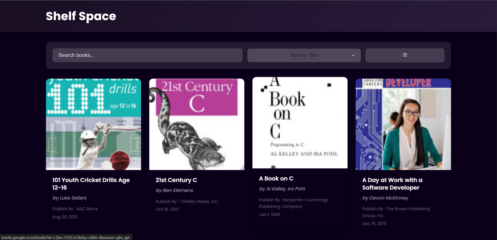

# 📚 [Shelf Space](https://shelf-space-eight.vercel.app/)  

A dynamic and user-friendly book library website that fetches and displays book data from the [FreeAPI.app](https://freeapi.hashnode.space/api-guide/apireference/getBooks). This project demonstrates API requests, handling JSON data, and rendering dynamic content using JavaScript.

## 🚀 Tech Stack
- HTML
- CSS
- JavaScript

## 🎯 Features
- 📖 Fetch books from the API and display them as a list or grid.
- 🔀 Toggle between list and grid views.
- 🔍 Search bar to filter books by title or author.
- 🔢 Sort books alphabetically by title or by published date.
- 📜 Implement pagination to fetch more books when scrolling.
- 🌐 Clicking a book opens more details in a new tab.

## 📡 API Endpoint
GET https://api.freeapi.app/api/v1/public/books

🌍 Live Demo

🔗 [Shelf Space](https://shelf-space-eight.vercel.app/)

## 📸 Screenshots

